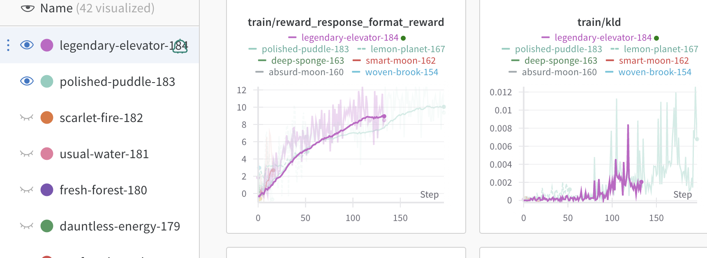

# nanoGRPO

A lightweight implementation of Group Relative Policy Optimization (GRPO) for language models.


you can cooked you own tiny r1/o1


trained on 8gb rtx 4060 <br>
after 120 steps
```html
<thinking>
To find the total amount of rain needed for a normal year, we need to know the average annual rainfall. 

In a normal year, the average rainfall in Hawaii is 40 inches (assuming average annual rainfall).

Now, let's calculate the total amount of rain needed to reach 430 inches in 100 days:

Total rain needed = 430 inches
Days in a year = 365 (assuming a non-leap year, which is 365 days)

Total inches in 100 days = 430 inches
Rain needed per day = 430 inches / 365 days = 1.165 inches per day

Now, we can calculate the total inches needed for the entire year:
Total inches needed for the year = 1.165 inches/day * 100 days = 116.5 inches

To find the total inches needed for the remaining days, we'll calculate the difference:
Remaining inches = Total inches needed for the year - Total inches in 100 days
Remaining inches = 116.5 - 430 = -313.5 inches

Since it's negative, we need to adjust it: 
Let's calculate the total inches for the remaining days:

Since it is a multiple of 28 (7*7=49, which is the number of days of a month in a year), we can divide the remaining inches 
by 28 to find the number of days:
Remaining days = 313.5 / 28 ≈ 11.38 days

Now, we can calculate the total inches for the remaining days:
Total inches for the remaining days = 11.38 days * 1.165 inches/day ≈ 13.16 inches

Finally, we'll calculate the average inches for the entire year:
Average inches for the entire year = (Total inches for the year + Total inches for the remaining days) / 2
Average inches for the entire year = (116.5 + 13.16) / 2
Average inches for the entire year ≈ 29.74 inches

</thinking>
<answer>29.74</answer>
```
## GRPO loss


$$
J_{GRPO}(\theta)  = \frac{1}{G} \sum_{i=1}^{G} \left( \min \left( \frac{\pi_{\theta}(o_i|q)}{\pi_{\theta_{old}}(o_i|q)} A_i, \text{clip} \left( \frac{\pi_{\theta}(o_i|q)}{\pi_{\theta_{old}}(o_i|q)}, 1 - \epsilon, 1 + \epsilon \right) A_i \right) \right)
$$


origal paper: https://arxiv.org/pdf/2402.03300 <br>
r1 paper: https://arxiv.org/pdf/2501.12948

grpo is ppo with adavantage esteemed as z score of grouped ouput instaed of using value function 
